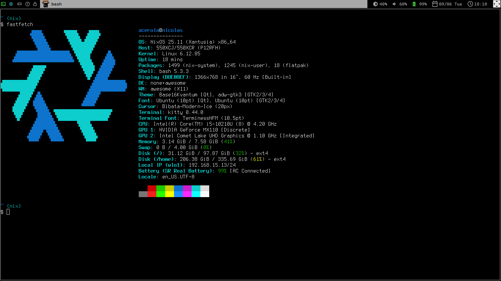

# NixOs Cofig



## Instalação

### 1. Instale o NixOS normalmente

<https://nixos.org/download/>

### 2. Clone o repositório

``` bash
git clone https://github.com/nicosobreira/nixos ~/nixos
```

### 3. Substitua o hardware-configuration.nix

```bash
cp /etc/nixos/hardware-configuration.nix ~/nixos/hardware-configuration.nix
```

### 4. Ajuste configurações pessoais

Edite o `flake.nix` e verifique `systemSettings` e `userSettings` conforme sua máquina.

Verifique se no `configuration.nix` as configurações `hardware.nvidiaEnable` e `hardware.intelEnable` batem.

### 5. Faça a build do sistema

``` bash
sudo nixos-rebuild switch --flake ~/nixos
```

## Agradecimentos

Obrigado [LibrePhoenix](https://github.com/librephoenix) por sua  [série de tutoriais](https://youtube.com/playlist?list=PL_WcXIXdDWWpuypAEKzZF2b5PijTluxRG&si=fiFiKyW_NWTqL4Re) e támbem por sua [repo](https://github.com/librephoenix/nixos-config)
